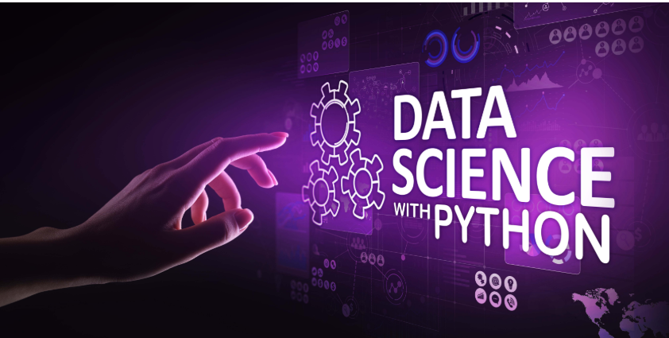
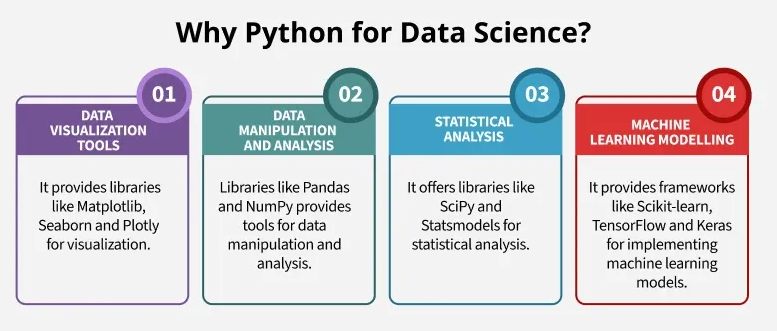

# 🐍 Python for Data Science: Foundational Exercises

This repository contains a series of exercises designed to build a strong foundation in Python programming, with an emphasis on skills relevant to data science. The project, titled **"Training Piscine Python for datascience - 0"**, covers essential concepts from basic syntax to more advanced topics like package creation and standalone programs.

## 🚀 What This Project Covers

This project is a starting point for anyone looking to get into data science using Python. It's structured to progressively build skills through practical exercises. Here's a brief overview of what you'll find:

-   **Basic Python Syntax**: The initial exercises focus on the fundamental building blocks of Python, including data types like lists, tuples, sets, and dictionaries.
-   **Functions and Scopes**: You'll learn to write and structure your code using functions, understanding concepts like function scope and error handling. This is crucial for creating reusable and maintainable code.
-   **Standalone Scripts**: The project guides you in creating autonomous programs that can be run from the command line and handle different arguments.
-   **Core Libraries**: You'll explore and implement functionalities from standard libraries like `sys` and `time`, which are essential for many data science tasks.
-   **Package Creation**: A key part of the project is learning how to create your own Python package, a vital skill for sharing your work with others and managing dependencies.

## 📊 Why Python for Data Science?

Python has become a dominant language in the data science community due to its simplicity, extensive ecosystem of libraries, and strong community support. Libraries like **NumPy** for numerical operations, **Pandas** for data manipulation, and **Matplotlib** for data visualization are cornerstones of the field. This project serves as a gateway to these tools by ensuring you have a solid grasp of the core language itself.

## 🔗 Useful Links

Here are some resources that can help you with the concepts covered in this project and with Python for data science in general:

* **Python Documentation**: The official documentation is your best friend for understanding Python's built-in functions, classes, and language syntax. [https://docs.python.org/3/](https://docs.python.org/3/)
* **GeeksforGeeks - Data Science with Python Tutorial**: This comprehensive tutorial provides an excellent overview of data science concepts using Python. [https://www.geeksforgeeks.org/data-science/data-science-with-python-tutorial/](https://www.geeksforgeeks.org/data-science/data-science-with-python-tutorial/)
* **The Hitchhiker's Guide to Python!**: A fantastic guide to best practices, tools, and the ecosystem of Python. [https://docs.python-guide.org/](https://docs.python-guide.org/)
